# C 语言的一些简单基础

## 1. 常量和变量

在计算机高级语言中，数据由两种表现形式：常量和变量

### 1.1. 常量

在程序运行过程中，其值不能被改变的量称为常量，又名字面量。

常用的常量：

- **整型常量**

- **实型常量** 

  - 十进制小数形式，由数字和小数点组成，如：123.456，0.23，-42.23，0.0。
  - 指数形式，如 12.34e3（代表 12.34 * 10^3）,-3.23e-25（代表 -3.23*10^25）

- **字符常量**

  - 普通字符，即'a','b','Z'

  - 转义字符，即以字符 \ 开头的字符，常用的以 \ 开头的特殊字符如下：

    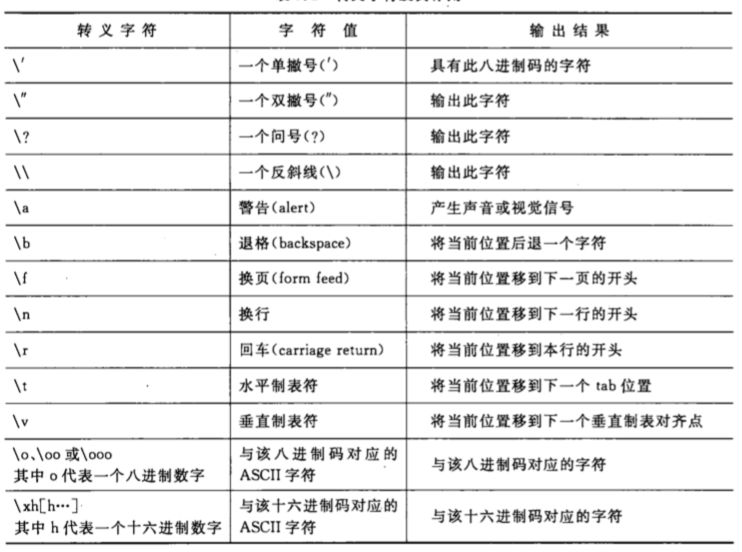

- **字符串常量**，即“1234”等

- **符号常量**，用 #define 指令，指定用一个符号名称代表一个常量，如：

  ```c
  #define PI 3.1416		//注意，此处没有分号；
  ```

  此后程序中所有 PI 全部置换为 3.1416

### 1.2. 变量

变量代表一个有名字的、具有特定属性的一个存储单元，在程序运行期间它的值可以改变，如下：

```c
int a = 3;
```

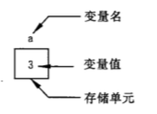

### 1.3. 常变量

C99 允许使用常变量，如：

```c
const int a = 3;
```

上述代码表示 a 被定义为一个整型变量，指定其值为 3，而且在变量存在期间不能改变。

常变量和常量的相同部分是：常变量具有变量的基本属性：有类型，占存储单元；

常变量和常量的不同部分是：常变量不允许改变其值。

所以可以理解为，常变量是有名字的不变量，常量是没有名字的不变量。

**疑问：符号常量和常变量有什么不同？**

```c
#define PI 3.1415
const float pi = 3.1415
```

以上 2 个都可在程序中使用，但二者性质不同；符号常量用 **#define** 指令，它是预编译指令，它只是用符号常量代表一个字符串，在预编译时仅是进行字符替换（即将程序中的 PI 替换成 3.1415），在编译后，符号常量就不存在了，对符号常量的名字（如上面的 PI）时不分配存储单元的。

从使用角度看，常变量有符号常量的优点，而且使用方便。

## 2. 数据类型

C 语言允许使用的类型如下，其中带有 * 的是 C99 所增加的。

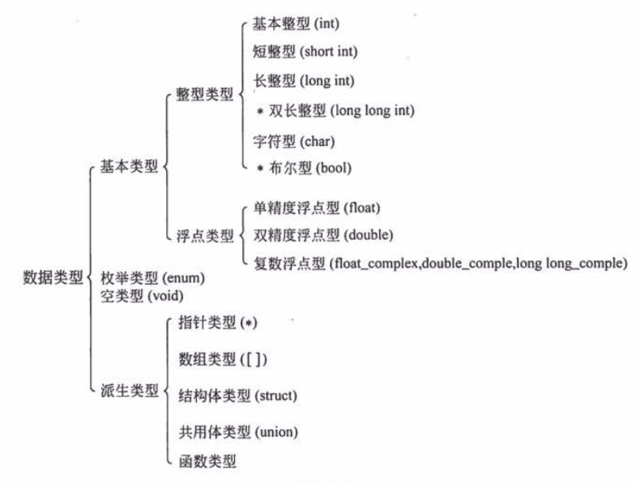

### 2.1. 整型 

1. **基本整型 int**

   编译系统分配给 int 型数据 2 个字节或 4 个字节（由具体 C 编译系统决定）。

   在存储单元中的存储方式是：用整数的补码（complement）形式存放。一个正数的补码是此数的二进制形式，如 5 的二进制形式是 101，如果用 2 个字节存放，如下所示：

   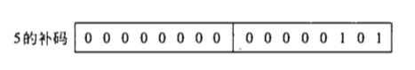

   如果是一个负数，求负数的补码的方法是：先获取此数的绝对值的二进制形式，然后对其后面所有二进位按位取反，再加 1。如 -5 的补码如下：

   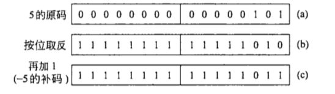

   **注意：** 在存放整数的存储单元中，最左一位是用来表示符号的，为 0 表示正数，1 表示负数。

   > 按给整型变量分配 2 个字节来算，则存储单元中能存放的最大值是 0111 1111 1111 1111，此数为（2^15-1），即十进制 32767，最小值 1000 000 0000 0000 此数是 -2^15，即 -32768。
   >
   > 2 字节下的 int 的值的范围是 -32768～32767，超过即溢出。

2. **短整型 short int**

   类型名为 short int 或 short，短整型 2 个字节。

3. **长整型 long int**

   类型名为 long int 或 long，长整型 4 个字节。

4. **双长整型 long long int**

   类型名为 long long int 或 long long，分配 8 个字节，是 C99 新增的。

5. **总结**

   sizeof(short) <= sizeof(int) <= sizeof(long) <= sizeof(long long)

   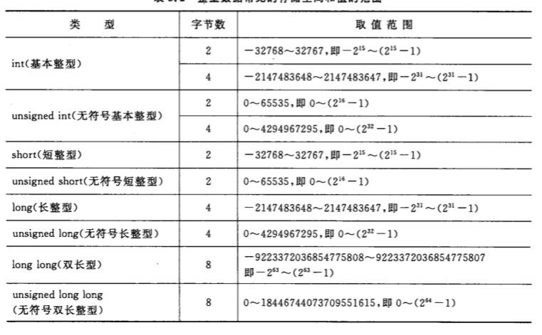

### 2.2. 字符型

字符实质是按其代码（整数）形式存储的，因此 C99 把字符数据作为整型数据的一种。但是，字符型数据在使用上也拥有自己的特点。

1. **字符与字符代码**

   一般程序中要在程序中使用字符，只能使用系统提供的字符，如目前绝大多数系统采用 ASCII 字符集。其基本集包含了 127 个字符，其中包括：

   - 字符：A～Z，a～z；
   - 数字：0～9；
   - 专门符号：29 个，如 ! # " " & + - { | } ~ 等等；
   - 空格符：空格、水平制表符（tap）、换行、换页；
   - 不能现实点字符：空 (null) 字符（以 '\0' 表示），警告（以 '\a' 表示），会车（以 '\r' 表示）等；

   如下面例子：

   ```c
   char a = '1';		// 定义字符 1
   ```

   存储方式如下：

   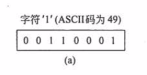

2. **字符变量**

   分析例子：

   ```c
   char c = '?';				// ? 的 ascii 码为 63
   printf("%d, %c\n",c,c);		// 输出 63, c
   ```

### 2.3. 浮点型

浮点数用来表示具有小数点的实数，为什么在 C 中把具有小数点的实数成为浮点数？因为，在 C 中，具有小数点的实数是以指数形式存放在存储单元中的。然而一个实数表示为指数有多种形式，如：2.1，可表示为 0.21\*10^1、0.021\*10^2，21\*10^-1等等，它们都表示同一个实数，然而小数点却可以在几个数字前后浮动，因此称 具有小数点的实数 为 浮点数。

在存储时，系统将实型数据分为 小数部分 和 指数部分 两个部分，小数部分的小数点前面的数为 0 。

例如：3.1416，在存储时表示为，0.31416*10^1，存储单元分配如下：

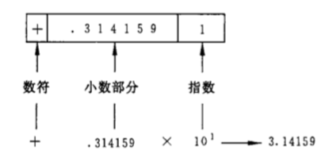

其中，存储单位由符号位，小数部分，指数部分组成，这里以十进制数表示，实际上为二进制。

1. **float 单精度浮点型**

   编译系统为每一个 float 分配 4 个字节，数值以规范化的二进制数指数形式存放在存储单元中，那么 4 个字节（32位）究竟多少为表示小数部分，多少位表示实数部分，具体由各 C 语言编译系统所决定。

   有的 C 语言编译系统以 24 位表示小数部分（包括符号号），8位表示指数（包括指数的符号位）。由于存储单元有限，因此不可能得到完全精确的值，只能存储成由限的精确度。

   小数部分的 bit 数愈多，数多有效数字越多，精度也就愈高。指数部分占到 bit 愈多，则表示数的范围越大。

2. **double 双精度浮点型**

   为了扩大能表示的数值范围，用 8 个字节存储一个 double 型数据。在 C 语言中进行浮点数的算术运算时，将 float 型都自动转为 double 型，然后再进行计算。

3. **long double 长双精度浮点型**

   不同的编译系统对 long double 对处理方式不同。

   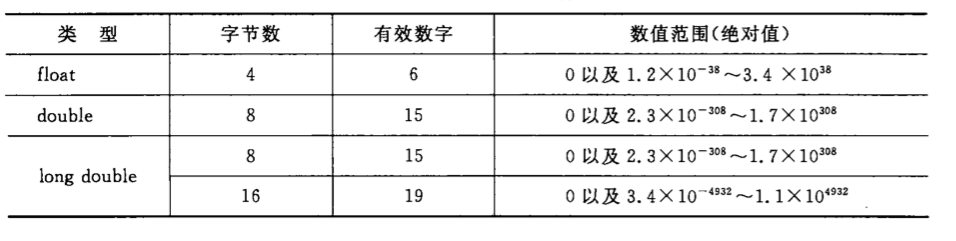


## 3. 数据的输入和输出

### 3.1. 输入输出的概念

所谓输入输出是以计算机主机为主题而言的。从计算机向输出设备输出数据成为**输出**，从输入设备向计算机输入数据成为**输入**。

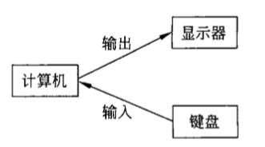

C 本身不提供输入输出语句，输入和输出操作是由 C 标准函数库 stdio.h 中的函数来实现的，例如 printf 和 scanf。

各种 C 编译系统提供的系统函数库是各软件公司编制的，它包括了 C 语言建议的全部标准函数，还根据用户需求补充一些常用的函数。

C 语言函数库中有一批“标准输入输出函数”，其中有：putchar（输出字符），getchar（输入字符），printf（格式输出），scanf（格式输入），puts（输出字符串），gets（输入字符串）。

### 3.2. printf 格式输出

使用 printf 输出时，必须指定输出数据格式类型。

一般格式为：

**printf( 格式控制, 输出表列 )**

```c
int a = 3, b = 4;
printf("a=%d b=%d\n",a,b);
// 输出: a=3 b=4
// \n 使输出控制移到下一行的开头
```

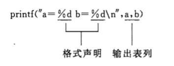

以上 %d 指明为整数，将会被输出表列中对应的数据替换，而其他非格式声明的普通字符（如 a= , b= 和 \n）全部按原样输出。

- printf 的格式字符

  | 格式符 |                             含义                             |
  | :----: | :----------------------------------------------------------: |
  |   d    |                用来输出一个有符号的十进制整数                |
  |   c    |                       用来输出一个字符                       |
  |   s    |                      用来输出一个字符串                      |
  |   f    | 输出实数（%m.nf可以指定小数位数，如：%7.2f，指的是小数位只有2位，小数点的数位7位） |
  |   e    | 以指数形式输出实数，如123.456，输出为1.234560 e+002（%m.ne 同上） |
  |   i    |                          与 d 相同                           |
  |   o    |                    以 八进制整数形式输出                     |
  |   x    |                    以十六进制整数形式输出                    |
  |   u    |           输出无符号型数据，以十六进制整数形式输出           |
  |   l    |          用于长整型整数，可加在格式d、o、x、u 前面           |

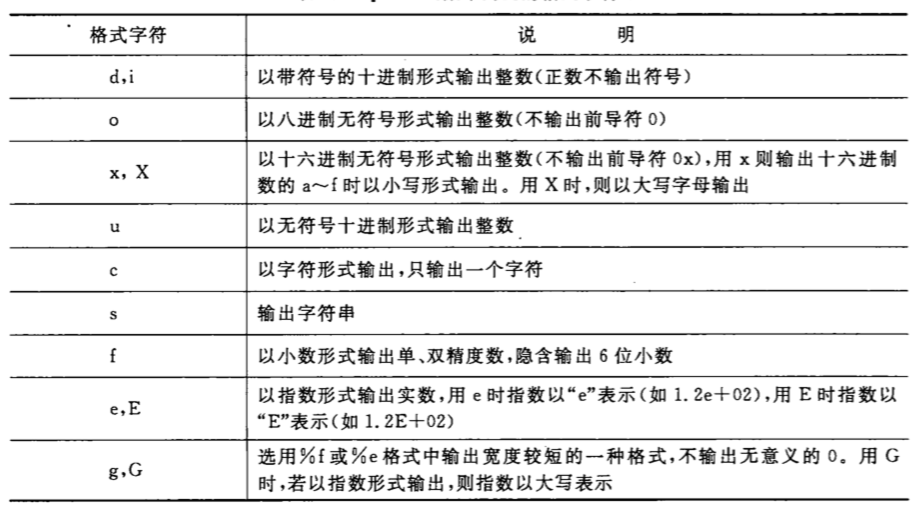

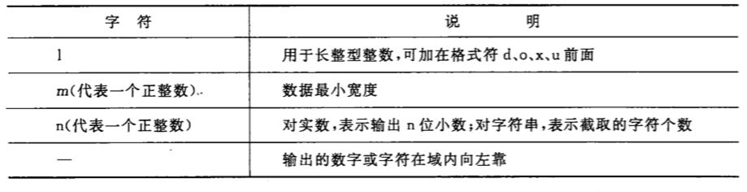

### 3.3. scarf 格式输入

scanf 函数的一般调用形式

**scanf( 格式控制，地址表列 )**

```c
int a;
scanf("%d", &a);
```

用法与 printf 相对类似，注意接收输入的数据，是变量的地址（&a），而不是变量本身（a）。

1. 如果在 格式控制字符串 除了格式声明还有其他字符串，如 *scanf("a=%d",a)* ，那么在键盘输入时，也要输入对应字符串，*<u>a=3</u>*。

2. 当输入多个数据时，如

    ```c
    scanf("%d%d%d",&a,&b,&c);
    ```

​	则在键盘输入时以 空格 为分隔，如：<u>3 4 5</u>

3. 当输入多个数据为字符时，空格 不再作为分隔，因为空格也会被视为字符，如

   ```c
   scanf("%c%c%c", &a,&b,&c);
   ```

   则在键盘输入时以 空格 为分隔，如：<u>abc</u>

4. 案例分析

   ```c
   scanf("%d%c%f",&a,&b,&c);
   ```

   键盘输入：<u>1234w 123o.26</u>

   第 1 个数据对应 %d 格式，在输入 1234 之后遇到 ‘w’，因此系统认为数值 1234 后没有数字了，因此 1234 赋值给 a；

   第 2 个数据对应 %c 格式，由于 c 只要求输入一个字符，因此 'w' 赋值给 b；

   第 3 个数据对应 %f 格式，如果由于疏忽把 1230.26 错打成 123o.26，那么系统读 123 遇到 ‘o’，认定为到此结束，将 123 赋值给 c。

   其余的没有被读入。

### 3.4. putchar 输出一个字符

输出一个字符，一般调用形式：**putchar(c)**，同时 putchar 可以输出转义字符，如 putchar('\101') 输出字符 A。

### 3.5. getchar 输入一个字符

输入一个字符，一般调用形式：**getchar()**，如果想输入多个字符就要用多个 get char 函数。


## 4. include 指令

在使用系统库函数时，要在程序文件的开头用预处理指令 #include 把有关头文件放在本程序中

```c
#include <stdio.h>
// or
#include "stdio.h"
```

用预编译指令 #include 的目标时将所需要的 头文件 包括到用户源文件中。如用到标准输入输出（printf，scanf），则要用到 “stdio.h” 头文件中提供的信息。stdio 是 standard input & output 的缩写，h 是 header 的缩写。

**以上两种 #include 指令的区别：** 

- 用尖括号形式（如\<stdio.h\>）时，编译系统从存放 C 编译系统的子目录中去找所要包含的文件，这称为**标准形式**。
- 用双撇号形式（如“stdio.h”）时，编译时编译系统现在用户的当前目录中寻找包含的文件，若找不到，再按标准形式查找，若包含的文件不在当前目录，也可以直接写入文件路径。


## 5. 算法的表示

### 5.1. 流程图

| 图框                   | 意义       |
| ---------------------- | ---------- |
|  | 起止框     |
| 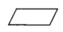 | 输入输出框 |
| 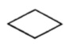 | 判断框     |
| 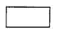 | 处理框     |
| 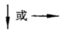 | 流程线     |
| 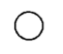 | 连接点     |
| 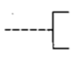 | 注释框     |

例如：

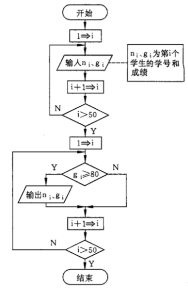

### 5.2. N-S 流程图


### 5.3. 伪代码


## 6. 位运算

| 符号 | 描述 | 运算规则                                                     |
| ---- | ---- | ------------------------------------------------------------ |
| &    | 与   | 两个位都为1时，结果才为1                                     |
| \|   | 或   | 两个位都为0时，结果才为0                                     |
| ^    | 异或 | 两个位相同为0，相异为1                                       |
| ~    | 取反 | 0变1，1变0                                                   |
| <<   | 左移 | 各二进位全部左移若干位，高位丢弃，低位补0                    |
| >>   | 右移 | 各二进位全部右移若干位，对无符号数，高位补0，有符号数，各编译器处理方法不一样，有的补符号位（算术右移），有的补0（逻辑右移） |

