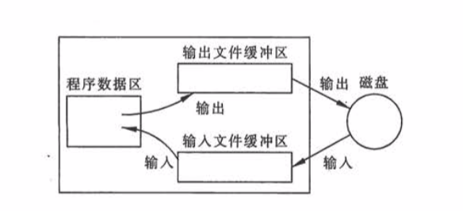

# 文件的输入输出

## 1. 关于文件

### 1.1. 简介	

​	文件（file），一般指存储在外部介质上数据的集合。一批数据是以文件的形式存放在外部介质（如磁盘）上的。

### 1.2. 程序设计中的主要文件类型

​	在程序设计中，主要用到两种文件：

- **程序文件：**

  包括源程序文件（后缀为.c）、目标文件（后缀为.obj）、可执行文件（后缀为.exe）等。这种文件等内容是程序代码。

- **数据文件：**

  文件等内容是供程序运行时读写的数据，如在程序运行过程中输出到磁盘（或其他外部设备）的数据，或在程序运行时过程中供读入的数据。

> 这次处，我们主要讨论的是**数据文件**。

​	在实际开发上，常常需要将一些数据（运行的最终结果或中间数据）输出到磁盘上保存起来，以后需要时再从磁盘中输入到计算机内存。这就要用到**磁盘文件**。


## 2. 关于文件输入输出

​	输入输出是数据传送的过程，数据如流水一样从一处流向另一处，因此常将输入输出形式形象地称为**流（stream）**，即**数据流**。

​	在输入操作时，数据从文件流向计算机内存，在输出操作时，数据从计算机内存流向文件（如磁盘文件、打印机）。

​	为了简化用户对输入输出设备的操作，操作系统**把各种设备都统一作为文件来处理**。


## 3. 文件的分类

​	根据数据的组织形式，数据文件可分为**ASCII文件**和**二进制文件**。

​	数据在内存中是以二进制形式存储的，如果不加转换地输出到外存，就是二进制文件，可以认为他就是存储在内存的数据的映像，称之为**映像文件（image file）**。入药要求在外存上以ASCII码形式输出到磁盘，则需要在存储前进行转换。ASCII文件又称**文本文件（txt）**，每一个字节放一个字符的ASCII码。


## 4. 数据在磁盘上如何存储？

​	**字符**一律以**ASCII**形式存储，**数值型**既可以用**ASCII**也可以**二进制**形式存储。如有整数10000，如果用ASCII输出，则在磁盘中占5个字节（每一个字符占一个字节），而用二进制输出，则在磁盘上只占4个字节，如下图：

> 在ASCII码表中，字符1对应的ASCII码值为49，字符0对呀的ASCII码值为48，49转为二进制为110001，48为110000。


- **ASCII码存储形式：**

  ASCII码形式输出时字节与字符一一对应，一个字节代表一个字符。

  - **优点：**便于对字符进行逐个处理，也便于输出字符。
  - **缺点：**占存储空间较多，而且要花费转换时间（二进制形式与ASCII码间的转换）

- **二进制形式存储：**

  - **优点：**节省外存空间和转换时间，把内存中的存储单元原封不懂地输出到磁盘（或其他外部介质）上。
  - **缺点：**每一个字节并不一定代表一个字符。

  

  ​	如果程序运行过程中有的中间数据需要保存在外部介质上，以便在需要时输入到内存，一般用二进制文件比较方便。


## 5. 文件缓冲区

​	ANSI C标准采用 **缓冲文件系统**  处理数据文件，所谓缓冲文件系统是指系统自动地在内存区为程序中每一个正在使用的文件开辟一个 **文件缓冲区** ，缓冲区的大小由C编译系统确定。

​	从内存向磁盘输出数据必先送到内存中的缓冲区，缓冲区装满后在一起送到磁盘上去。同样的，如果从磁盘向计算机读入数据，则一次从磁盘文件将一批数据输入到内存缓冲区，充满缓冲区后，再从缓冲区逐个地将数据送到程序数据区（程序变量），如下图：



## 6. 文件类型指针

### 6.1. 简介

​	在缓冲区文件系统中，关键的概念是 **文件类型指针** ，简称 **文件指针**。每个被使用的文件都在内存中开辟一个相应的文件信息去，用来存放文件的有关信息（如名字，状态、位置等）。这些信息是保存在一个结构体变量中。该结构体类型由系统声明，取名为 **FILE** 。例如：有一种C编译环境提供的 stidio.h 头文件中有一下的文件类型声明：

```c
typeof struct
{
    short level;			//缓冲区“满“、”空“程序
    unsigned flags;			//文件状态标志
    char fd;				//文件描述符
    unsigned char hold;		//如缓冲区无内容不读区字符
    short bsize;			//缓冲区大小
    unsigned char* buffer;	//数据缓冲区的位置
    unsigned char* curp;	//指针当前的指向
	unsigned istemp;		//临时文件指示器
    short token;			//用于有效性检查
}FIFE;
```

​	对以上结构体成员及其含义不可深究，只须知道其中存放文件的有关信息即可。

### 6.2. 使用

​	一般通过设置一个指向 FILE 类型变量的指针变量，然后通过它来应用这些 FILE 类型变量。


## 7. 打开文件与关闭文件

### 7.1. 使用 fopen 函数打开数据文件

​	ANSI C 规定来用标准输入输出函数 fopen 来实现打开文件。

​	fopen 函数的调用方式为：

​	**fopen( 文件名, 使用文件方式 )**，例如：fopen( "hello.txt", "r" ); 表示要打开名字为“hello.txt”文件，使用文件方式为 “读入”（ r 代表 read，即读入 ）。通常将 fopen 函数返回值赋给一个指向文件的指针变量。如：

```c
FILE *fp;
fp = fopen("hello.txt", "r");
```

>  这样 fp 就和 hello.txt 相联系了，fp 指向 hello.txt 。

可以得知，在打开一个文件时，通知编译系统一下 3 个信息：

- 需要打开的文件的名字
- 使用文件的方式
- 使用一个指针变量指向被打开读文件

通常使用一下方法打开一个文件：

```c
if ( (fp = fopen("file1", "r")) == NULL ) 
{
    printf("cannot open this file\n");
    exit(0);
}
```


### 7.2. 使用文件的方式

| 文件使用方式  | 含义                                     | 如果制定的文件不存在 |
| ------------- | ---------------------------------------- | -------------------- |
| “r”（只读）   | 为了输入数据，打开一个已存在的文件本文件 | 出错                 |
| “w”（只写）   | 为了输入数据，打开一个文件本文件         | 建立新文件           |
| “a”（追加）   | 向文本文件尾添加数据                     | 出错                 |
| “rb”（只读）  | 为了输入数据，打开一个二进制文件         | 出错                 |
| “wb”（只写）  | 为了输入数据，打开一个二进制文件         | 建立新文件           |
| “ab”（追加）  | 向二进制文件尾添加数据                   | 出错                 |
| “r+”（读写）  | 为了读和写，打开一个文本文件             | 出错                 |
| “w+”（读写）  | 为了读和写，打开一个新的文本文件         | 建立新文件           |
| “a+”（读写）  | 为了读和写，打开一个文本文件             | 出错                 |
| “rb+”（读写） | 为了读和写，打开一个二进制文件           | 出错                 |
| “wb+”（读写） | 为了读和写，打开一个新的二进制文件       | 建立新文件           |
| “ab+”（读写） | 为了读和写，打开一个二进制文件           | 出错                 |


### 7.3. 使用 fclose 函数关于数据文件

​	在使用完一个文件后，应该关闭它，防止它被误用。“关闭” 就是撤销文件信息区和文件缓冲区，使文件指针不再指向该文件，也就是文件指针banal与文件“脱钩”。

​	fclose 函数的调用方式为：

​	**fclose( 文件指针 )**；例如：fclose( fp );

​	如果不关闭文件将有可能会丢失数据。因为，在向文件写数据时，是先将数据输出到缓冲区，待缓冲区充满后才正式输出给文件。如果当数据为充满缓冲区而程序结束运行，有可能使缓冲区数据丢失。要用 fclose 函数关闭文件，先把缓冲区中的数据输出到磁盘文件，然后才撤销文件信息区。

​	fclose 函数也带回一个值，当成功关闭操作，则返回值为 0；否则返回 EOF(-1)。


## 8.读写文件

### 8.1. 使用 fgetc 读文件

| 函数名 | 调用形式  | 功能                         | 返回值                                                  |
| ------ | --------- | ---------------------------- | ------------------------------------------------------- |
| fgetc  | fgetc(fp) | 从 fp 指向的文件读入一个字符 | 读成功，返回所读字符，失败则返回文件结束标志 EOF(即 -1) |

### 8.2. 使用 fputc 写文件

| 函数名 | 调用形式  | 功能                                         | 返回值                                                    |
| ------ | --------- | -------------------------------------------- | --------------------------------------------------------- |
| fputc  | fputc(fp) | 把字符 ch 写到文件指针变量 fp 所指向的文件中 | 输入成功，返回所读字符，失败则返回文件结束标志 EOF(即 -1) |

### 8.3. 读写示例

```c
#include <stdio.h>
#include <stdlib.h>
int main() 
{
    FILE *in,*out;
    char ch, infile[10], outfile[10];
    scanf("%s",infile);
    scanf("%s",outfile);
    if((in = fopen(infile,"r")) == NULL)
    {
        exit(0);
    }
    if((out = fopen(outfile,"w")) == NULL)
    {
        exit(0);
    }
    while(!feof(in))
    {
        ch = fgetc(in);
        fputc(ch,out);
        putchar(ch);
    }
    putchar(10);
    fclose(in);
    fclose(out);
    return 0;
}
```

### 8.4. 向文件读写一个字符串

| 函数名 | 调用形式          | 功能                                                         | 返回值                               |
| ------ | ----------------- | ------------------------------------------------------------ | ------------------------------------ |
| fgetc  | fgetc(str, n, fp) | 从 fp 指向的文件读入一个长度为（n-1）的字符串，存放到字符串 str 中。 | 读成功，返回地址 str，失败则返回NULL |
| fputs  | fgetc(str, fp)    | 把 str 所指向的字符串写到文件指针变量 fp 所指向的文件中      | 输出成功，返回 0；否则返回非 0 值    |


### 8.5. 用格式化的方式读写文件

printf 和 scanf 是常用于向终端进行格式化输入输出，其实也可以对文件进行格式化输入输出，即 **fprintf** 和 **fscanf** ，其一般调用形式为：

```c
fprintf( 文件指针, 格式化字符串, 输出列表);
fscanf( 文件指针, 格式化字符串, 输入列表);
```

例如：

```c
fprintf( fp, "%d,%6.2f", i, f );
fscanf( fp, "%d,%f", &i, &f );
```


### 8.6. 用二进制方式向文件读写一组数据

c 语言可以使用 fread 函数从文件中读取一个数据块，使用 fwrite 函数向文件写入一个数据库。在读写时是以二进制形式进行的。

其一般调用形式如下：

```c
fread( buffer, size, count, fp );
fwrite( buffer, size, count, fp );
```

- buffer：是一个地址。对于 read 时，它是用来存放从文件读入的数据的存储区地址；对于 write 时，时要把此地址开始的存储区中的数据向文件输出（以上指的是起始地址）；
- size：要读写的字节数；
- count：要读写多少个数据项（每个数据项的长度即为上面的 size ）
- fp：FILE 类型指针


### 8.7. 随机读写数据文件

当一个文件中有 1000 个数据，若只查第 1000 个数据，必须先逐个读入前面 999 个数据，才能读入第 1000 个数。

随机访问不是按数据在文件中的物理位置次序进行读写，而是可以对任何位置上的数据进行访问，显然这种方法比顺序访问效率高得多。

#### 8.7.1. 文件位置标记

为了对读写进行控制，系统为每个文件设置了一个文件读写位置标记，用来指示“接下来要读写的下一个字符的位置”。

一般情况下，对字符文件按顺序读写时，文件位置标记指向文件开头，读一个字符，位置标记就往后移一个位置。


#### 8.7.2. rewind

rewind 函数使文件位置只想文件头，此函数没有返回值。

**代码案例**

```c
#include<stdio.h>
int main()
{
    FILE *fp1, *fp2;
    fp1 = fopen("file1.dat", "r");
    fp2 = fopen("file2.dat", "w");
    while(!feof(fp1))
        putchar(getc(fp1));
    putchar(10);
    rewind(fp1);
    while(!feof(fp1))
        putc(getc(fp1),fp2);
    fclose(fp1);
    fclose(fp2);
    return 0;
}
```

#### 8.7.3. fseek

用 fseek 函数改变文件位置标记，其调用形式为：

**fseek(文件类型指针, 位移量, 起始点)**

- **起始点**用 “0，1，2” 代替，0 代表 “文件开始位置” ，1 位“当前位置” ，2 为“文件末尾位置” 。

  |    起始点    |   名字   | 用数字代表 |
  | :----------: | :------: | :--------: |
  | 文件开始位置 | SEEK_SET |     0      |
  | 文件当前位置 | SEEK_CUR |     1      |
  | 文件末尾位置 | SEEK_END |     2      |

- **位移量**指以起始点为基点，向前移动的字节数。位移量是 long 型数据，例如：

  ```c
  fseek(fp, 100L, 0); 	//将文件位置标记向前起移到离文件开头 100 个字节处
  fseek(fp, 50L, 1); 		//将文件位置标记向前起移到离当前位置 100 个字节处
  fseek(fp, -10L, 2); 	//将文件位置标记从文件末尾向后退 10 个字节处
  ```

### 9. 文件读写的出错检测

C 提供一些函数用来检查输入输出函数调用时可能出现的错误。

### 9.1. ferror(filePoint) 函数

在调用各种输入输出函数（putc，getc，fread，fwrite）时，如果出现错误，除了函数返回值有所反映外，还可以用 ferror 函数检查。

如果 ferror 返回值为 0 ，则为出错；

如果 ferror 返回值为一个非零值，表示出错。

在调用 fopen 函数时，ferror 初始值自动置为 0 。

### 9.2 clearerr(filePoint) 函数

clearerr 的作用是使文件错误标志和文件结束标志置为 0 。

假设在调用一个输入输出函数时出现错误，ferror函数值为一个非零值，应该立即调用 clearerr(fp) ，使 ferror(fp) 的值变为 0 ，以便进行下一次的检测。


