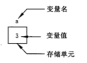
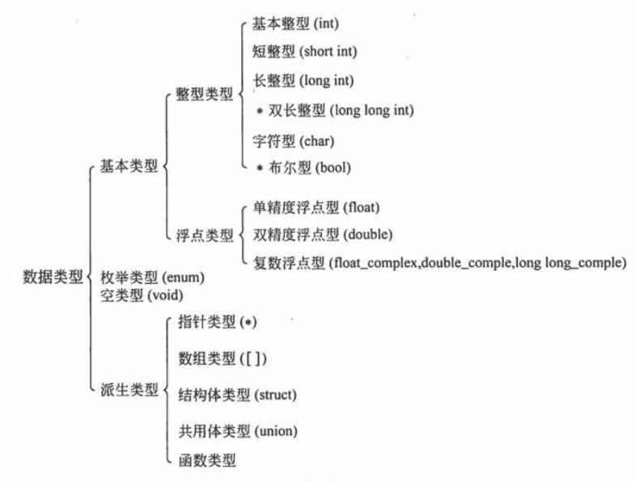
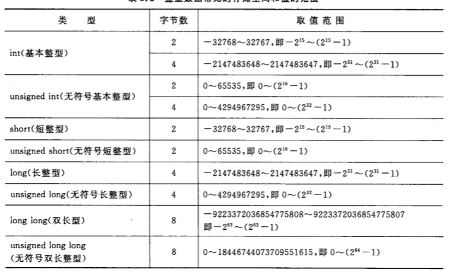

# C 语言的一些简单基础

## 1. 常量和变量

在计算机高级语言中，数据由两种表现形式：常量和变量

### 1.1. 常量

在程序运行过程中，其值不能被改变的量称为常量，又名字面量。

常用的常量：

- **整型常量**

- **实型常量** 

  - 十进制小数形式，由数字和小数点组成，如：123.456，0.23，-42.23，0.0。
  - 指数形式，如 12.34e3（代表 12.34 * 10^3）,-3.23e-25（代表 -3.23*10^25）

- **字符常量**

  - 普通字符，即'a','b','Z'

  - 转义字符，即以字符 \ 开头的字符，常用的以 \ 开头的特殊字符如下：

    

- **字符串常量**，即“1234”等

- **符号常量**，用 #define 指令，指定用一个符号名称代表一个常量，如：

  ```c
  #define PI 3.1416		//注意，此处没有分号；
  ```

  此后程序中所有 PI 全部置换为 3.1416

### 1.2. 变量

变量代表一个有名字的、具有特定属性的一个存储单元，在程序运行期间它的值可以改变，如下：

```c
int a = 3;
```



### 1.3. 常变量

C99 允许使用常变量，如：

```c
const int a = 3;
```

上述代码表示 a 被定义为一个整型变量，指定其值为 3，而且在变量存在期间不能改变。

常变量和常量的相同部分是：常变量具有变量的基本属性：有类型，占存储单元；

常变量和常量的不同部分是：常变量不允许改变其值。

所以可以理解为，常变量是有名字的不变量，常量是没有名字的不变量。

**疑问：符号常量和常变量有什么不同？**

```c
#define PI 3.1415
const float pi = 3.1415
```

以上 2 个都可在程序中使用，但二者性质不同；符号常量用 **#define** 指令，它是预编译指令，它只是用符号常量代表一个字符串，在预编译时仅是进行字符替换（即将程序中的 PI 替换成 3.1415），在编译后，符号常量就不存在了，对符号常量的名字（如上面的 PI）时不分配存储单元的。

从使用角度看，常变量有符号常量的优点，而且使用方便。

## 2. 数据类型

C 语言允许使用的类型如下，其中带有 * 的是 C99 所增加的。



### 2.1. 整型 

1. **基本整型 int**

   编译系统分配给 int 型数据 2 个字节或 4 个字节（由具体 C 编译系统决定）。

   在存储单元中的存储方式是：用整数的补码（complement）形式存放。一个正数的补码是此数的二进制形式，如 5 的二进制形式是 101，如果用 2 个字节存放，如下所示：

   

   如果是一个负数，求负数的补码的方法是：先获取此数的绝对值的二进制形式，然后对其后面所有二进位按位取反，再加 1。如 -5 的补码如下：

   

   **注意：** 在存放整数的存储单元中，最左一位是用来表示符号的，为 0 表示正数，1 表示负数。

   > 按给整型变量分配 2 个字节来算，则存储单元中能存放的最大值是 0111 1111 1111 1111，此数为（2^15-1），即十进制 32767，最小值 1000 000 0000 0000 此数是 -2^15，即 -32768。
   >
   > 2 字节下的 int 的值的范围是 -32768～32767，超过即溢出。

2. **短整型 short int**

   类型名为 short int 或 short，短整型 2 个字节。

3. **长整型 long int**

   类型名为 long int 或 long，长整型 4 个字节。

4. **双长整型 long long int**

   类型名为 long long int 或 long long，分配 8 个字节，是 C99 新增的。

5. **总结**

   sizeof(short) <= sizeof(int) <= sizeof(long) <= sizeof(long long)

   

### 2.2. 字符型

stopped by 47（67）