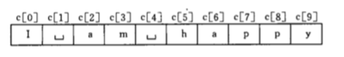
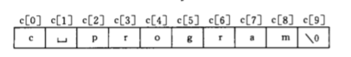
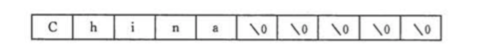
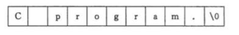
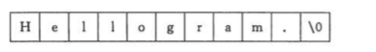
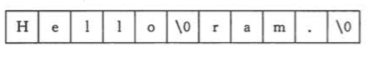
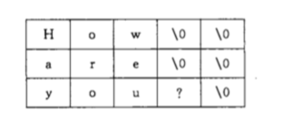
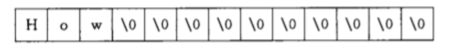

# 字符数组

## 1. 关于定义字符数组

定义字符数据存放字符 “I am happy”

```c
char c[10];
c[0] = "I";
C[1] = " "；
//...
c[9] = "y";
```

字符数组 c 赋值后的状态如下：



由于字符型数据是以**整数形式（ASCII 代码）** 存放的，所以直接用整型数组来存放字符数据也是可以的。


## 2. 字符数组的初始化

### 2.1. 指定长度

如果定义字符数组时，初始化值个数小于数组长度，则只将这些字符赋给数组中前面那些元素，其余的元素自动定位空字符（即 '\0' ）。

如：

```c
char c[10] = {'c',' ','p','r','o','g','r','a','m'};
```



### 2.2. 不指定长度

在定义时也可以省略数组长度，系统会自动根据初始值个数确定数组长度。

如：

```c
char c[] = {'I',' ','a','m',' ','h','a','p','p','y'};
```

## 3. 字符串和字符串结束标志

在 C 语言中，是将**字符串**作为**字符数组**来处理的。

### 3.1. 字符串结束标志

C 系统在字符数组存储字符常量时会自动补加一个 **‘\0’** 作为结束符。

例如：“C Program” 共有 9 个字符，该字符串是存放在一维数组中的，在数组中它占 10 个字节，最后一个字节 ‘\0’ 是由系统自动加上的。

> 下面例子的 c 长度不为 9， 而为 10（加上'\0'）

```c
char c[] = "C Program";
// 等价于
char c[] = {'C',' ','P','r','o','g','r','a','m','\0'};
// 不等价于
char c[] = {'C',' ','P','r','o','g','r','a','m'};
```

‘\0’ 作为字符串结束标志，比如，在执行 printf 函数时，每输出一个字符检查一次，查看下一个字符是否 ‘\0’ ，遇 ‘\0’ 则停止输出。


再看一个例子：

```c
char c[10] = {'C','h','i','n','a'};
```

数组 c 的前 5 个元素为 'C'，'h'，'i'，'n'，'a'，后面没有赋值的全部置为'\0'，代表空字符，如下图：



### 3.2. 应用结束标志

假如定义了字符数组：

```c
char c[] = {"C program."};
```

其存储情况如下：



若想用一个新的字符串代替原有字符串，从键盘上输入“Hello”分别赋给 c 数组的前 5 个元素。如果不加 ‘\0’，其存储情况如下：



新字符串和老字符串连成一片，打印输出结果为：

> Hellogram.

此时在 “Hello” 后加一个 '\0' ，它代替了第 6 个字符 ‘g’ ，其存储情况如下：



其打印结果则为：

> Hello


## 4. 字符数组的输入输出

### 4.1. 关于输出

```c
char c[] = {"China"};
printf("%s\n", c);

// 输出 China
```

### 4.2. 关于输入

**scanf("%s",c)**，从键盘上输入字符，确定时，系统会自动在输入的值后面加上一个 ‘\0’ 结束符。

如果利用一个 scanf 函数输入多个字符串时，则应在输入时以空格分隔，如：

```c
char str1[5], str2[5], str3[5];
scanf("%s%s%s",str1,str2,str3);
// 键盘输入：How are you？
```

输入完毕后它们的存储情况如下：



若改为：

```c
char str1[13];
scanf("%s",str1);
// 键盘输入：How are you？
```

由于系统把空格字符作为输入的字符串之间的分隔符，所以导致其存储情况如下：



## 5. 关于字符串处理函数

当在使用字符串处理函数时，应当在程序文件开头用：

```c
#include <string.h>
```

### 5.1. puts 函数 - 输出

puts 是输出字符串的函数，一般调用形式为：

```c
char str[] = {"China\Beijing"};
puts(str);
// 输出结果：
// China
// Beijing
```

### 5.2. gets 函数 - 输入

gets 函数的作用是实现从终端输入一个字符串到字符数组，并且得到一个函数值，该函数值是字符数组的起始地址。

### 5.3. strcat 函数 - 连接

strcat 函数的作用是实现把 2 个字符数组中的字符串连接起来。

strcat(字符串1, 字符串2) 实现把 ”字符串 2“ 拼接到 “字符串 1” 后面，并返回一个函数值，即 字符串1 数组的地址。

### 5.4. strcpy 函数 - 复制

strcpy 函数的作用是实现字符串复制。

strcpy(字符串1, 字符串2) 把 “字符串2” 复制到 “字符串1” 中去，“字符串 2” 也可以是个字符串常量。

```c
char str1[10],str1[] = "China";
strcpy(str1,str2)
//or
strcpy(str1, "China");
```

### 5.5. strcmp 函数 - 比较

strcpy(字符串1, 字符串2) 将 “字符串1” 与 “字符串2” 进行比较，比较规则为：将两个字符串自左往右逐个字符相比（按 ASCII 码值大小比较），直到出现不同的字符 或 遇到 '\0' 为止。

函数返回值：

- 0，字符串1 == 字符串2
- 正整数，字符串1 > 字符串2
- 负整数，字符串1 < 字符串2

### 5.6. strlen 函数 - 字符串长度

strlen 函数的作用是获取字符串实际长度（不包含‘\0’）。

### 5.7. strlwr 函数 - 转为小写

strlwr 函数的作用是把字符串中大写的字母转换为小写。

### 5.8. strupr 函数 - 转为大写

strupr 函数的作用是把字符串中小写的字母转换为大写。


stop by 163