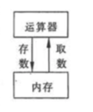

# 变量和函数

## 1. 变量的存储方式

从变量的作用域看，变量可分为 全局变量 和 局部量；从变量值 **存在的时间（即生存期）** 来观察，变量的存储方式有两种：静态存储方式 和 动态存储方式。

在内存中，供用户使用的存储空间的情况，可分为 3 部分：

- 程序区
- 静态存储区
- 动态存储区

### 1.1. 动态存储方式

在动态存储区中主要存放以下数据：

1. 函数形式参数。在调用函数时给实参分配存储空间。
2. 函数中定义的没用关键字 static 声明的变量，即自动变量。
3. 函数调用时的现场保护和返回地址等。

对以上数据，在函数调用开始时分配动态存储空间，函数结束是否这些空间。

在程序执行过程中，如果一个程序中两次调用用一个函数，而在此函数中又定义了局部变量，那么，在两次调用时分配给这些局部变量的存储空间的地址可能是不相同的。

### 1.2. 静态存储方式

全局变量全部存放在静态存储区，在程序执行过程中他们占据固定的存储单元，程序执行完毕就释放。

## 2. 存储类别

### 2.1. 局部变量的存储类别

在 C 语言中，每一个变量和函数都有两个属性：**数据类型**和**数据的存储类别**。其中，存储类别指的是数据在内存中存放的方式。

C 的存储类别包括 4 种：自动的（auto）、静态的（static）、寄存器的（register）、外部的（extern）。

#### 2.1.1. auto（自动变量）

函数中的局部变量，如果不专门声明为 static （静态）存储类别，都是动态地分配存储空间，数据存储在动态存储区中。

在平常的函数中的形参和在函数中定义的局部变量，都属于 auto（自动变量），自动变量使用关键字 auto 作为存储类别的声明，如：

```c
int f(int a)
{
    auto int b,c = 3;
    //..
}
//  其中，a 为形参，b 和 c 是自动变量，对 c 赋初值为 3 。
//  执行完函数 f 后，自动释放 a，b，c 所占的存储单元。
```

实际上，关键字 auto 可以省略，因为默认不写数据类别时，默认隐含地指定为 “自动存储类别”，即

```c
int b,c = 3;
auto int b,c = 3;
// 两者时等价的
```

#### 2.1.2. static（静态局部变量）

用 static 声明的局部变量的值在函数调用结束后不会消失，即其占用的存储单元不释放，如以下案例：

 ```c
int f(int);
int main()
{
	int a = 2, i;
    for(i = 0; i < 3; i++)
    {
        printf("%d\n", f(a));
    }   
    return 0;
}
int f(int a)
{
    auto int b = 0;
    static c = 3;
    b = b + 1;
    c = c + 1;
    return (a + b + c);
}
 ```

运行结果为：

```c
// 7
// 8
// 9
```

#### 2.1.3. register（寄存器变量）

一般情况下，变量（包括静态存储方式和动态存储方式）的值是存放在内存中的。

当程序要用到哪一个变量的值时，由控制器发出指令将内存中的钙变量的值运送到运算器中。经过运算器运行，如果需要存数，再从运算器将数据送到内存存放。



问题：当有一些变量使用频繁（例如，在一个函数中执行了 10000 次循环，每次循环中都要应用某局部变量），则为存取变量的值要花费不少时间。

解决：为了提高执行效率，允许局部变量的值存放在 CPU 中的寄存器中，需要用时直接从寄存器取出参加运算，不必再到内存中去存取。

由于对寄存器的存取速度远高于对内存的存取速度，因此这样做可以提高执行效率。这种存储类别的变量也叫做 **寄存器变量**，用关键 **register** 声明。

#### 2.1.4. 总结

由于现在计算机速度愈来愈快，性能愈来愈高，优化的编译系统能够识别使用频繁的变量，从而自动地讲这些变量放在寄存器中，而不需程序设计这设计。

因此，实际上使用 register 声明变量的必要性不大。

由以上可知，3 种局部变量的存储位置是不同的：自动变量（auto）存储在动态存储区；静态变量（static）存储在静态存储区；寄存器变量（register）存储在 CPU 的寄存器中。

### 2.2. 全局变量的存储类别

全局变量都是存放在静态存储区中的。它们的生存期是固定的，存在于程序的整个运行过程。

问题：对于全局变量，它的作用域究竟是什么位置起，什么位置止，作用域是包括整个文件范围？还是文件中的一部分范围？是一个文件中有效，还是程序的所有文件都有效？

解决：指定存储类别

#### 2.2.1. extern（外部变量声明）

如果全局变量不在文件开头定义，其有效范围只限于定义处到文件结束。

在定义点之前到函数不用引用该全局变量。

若在定义点之前到函数需要饮用该全局变量，则应使用关键字 **extern** 对该全局变量做 **外部变量声明** ，表示把该全局变量扩展到此位置。

例如：

```c
#include <stdio.h>
int main()
{
    extern int A; // 把外部变量A，扩展到从此处
    printf("%d",A);
}
int A = 10; // 在此定义全局变量 A
```

注：用 extern 声明外部变量时，类型名可以补血，因为extern 不是定义变量，而是声明为外部变量，只须写出外部变量名即可。

#### 2.2.2. 将外部变量的作用域扩展到其他文件

一个 C 程序可以由一个或多个源程序文件组成。如果程序由多个源程序文件组成，那么就会有这样的问题：

在一个文件中引用另一个文件中已定义的外部变量，如果一个程序包含 2 个文件，2 个文件同时要用到一个外部变量 Num，不能分别在两个文件中各自定义一个外部变量 Num，否则会报错。

正确的做法是：

在任意一个文件中定义外部变量 Num，而在另一个文件中用 extern 对Num做“外部变量声明”，即“ extern Num”。则编译和连接时，系统会由此知道 Num 有“外部链接”，可以从别处找到一定义的外部变量 Num，例如：

- 文件 file1.c

  ```c
  #include <stdio.h>
  int A = 10; // 定义全局变量
  ```

- 文件 file2.c

  ```c
  #include <stdio.h>
  extern int A; // 把在 file1 中定义的全局变量的作用域扩展到本文件
  int main()
  {
      printf("%d",A);
  }
  ```

#### 2.2.3. 将外部变量的作用域限制在本文件中

使用 static 声明，则外部变量被限制在本文件中引用。

```c
static int A = 10;
```

这种加上 static 声明、只能用于本文件的外部变量成为 **静态外部变量**。

## 3. 内部函数和外部函数

函数本质上是全局的，一个文件中的函数既可以被本文件中其他函数调用，也可以被其他函数调用。但是，也可以指定某些函数不能被其他文件调用。根据函数能否被其他源文件调用，将函数区分为**内部函数**和**外部函数**。

### 3.1. 内部函数

如果一个函数只能被本文件中其他函数所调用，它成为**内部函数**(又称为，静态函数)。在定义内部函数时，在函数名和函数类型的前面加 **static** ，即：

​	**static 类型名 函数名( 形参表) ；**

例如：

```c
static int fun(int a, int b)
```

通常吧只能由本文件使用的函数和外部变量放在文件的开头，前面都冠以 static 使之局部化，其他文件不能应用。这就提高了程序的可靠性，同时也不用担心同一个工程下，其他文件与本文件中的内部函数同名冲突的情况。

### 3.2. 外部函数

用 **extern** 关键字可以声明此函数为外部函数，定义函数时省略函数类别，默认为外部函数。

当要跨文件调用函数时，须对此函数声明，需要添加关键字 **extern** ，表示该函数“是在其他文件中定义的外部函数”。

例如：

1. 在 file1.c 中定义外部函数

```c
// file1.c
#include <stdio.h>

void print_string(char str[])
{
    printf("%s\n",str);
}
```

2. 在file2.c 中调用

```c
// file1.c
#include <stdio.h>

int main()
{
    extern void print_string(char str[]);
    print_string("hello");
    return 0;
}
```


stopped by 219